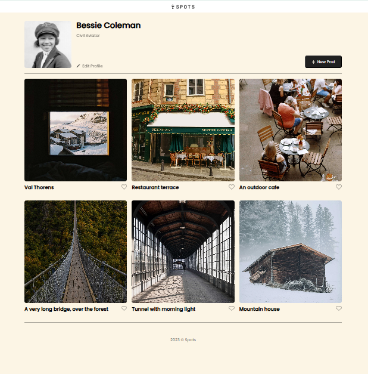
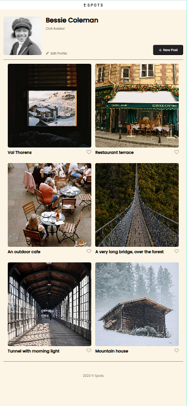
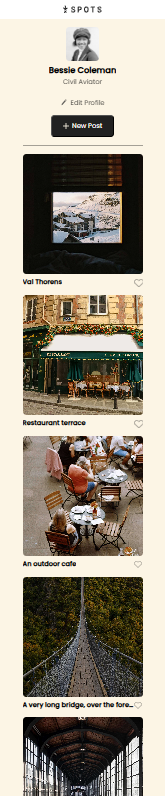

# Spots

## Project Description

**Spots** is a responsive image-sharing webpage built as part of the TripleTen Software Engineering program.  
In this stage of the project, the focus is on **responsive design**, ensuring the layout adapts smoothly across desktop, tablet, and mobile screen sizes.

The page allows users to:

- View a profile section
- Browse image cards arranged in a responsive grid
- Experience consistent layout and styling across different devices

---

## Functionality

- Fully responsive layout for:
  - **Desktop (1320px and wider)** — 3 cards per row
  - **Tablet (630px–1320px)** — 2 cards per row
  - **Mobile (320px–630px)** — stacked layout optimized for small screens
- Page content is centered with a maximum width of **1280px**
- Responsive card grid built with **CSS Grid**
- Profile section adapts from row layout (desktop) to column layout (mobile)
- Text overflow is handled using:
  - Ellipsis for single-line text
  - Multi-line truncation for longer profile text
- Hover states implemented according to the UI Toolkit
- No horizontal scrolling at any screen size

---

## Technologies & Techniques Used

- **HTML**
- **CSS**
- **CSS Grid**
- **Flexbox**
- **Media Queries**
- **Responsive design principles**
- **Text overflow handling**
- **BEM naming convention**
- **Figma** for layout and design reference

---

## Screenshots

---

## Live Project

🔗 GitHub Pages Deployment:
https://keriurban.github.io/se_project_spots/

---

## Project Pitch Video

📽️ Video Presentation:
[Link to your project pitch video here]

---

## Notes

This project was completed following the provided Figma designs and TripleTen project guidelines.
All responsiveness was implemented using CSS only, without JavaScript, as required for this stage.
